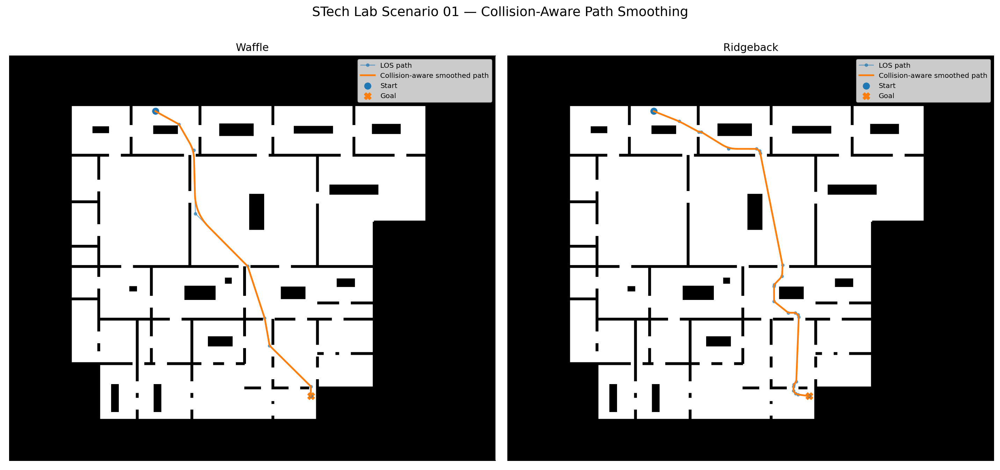
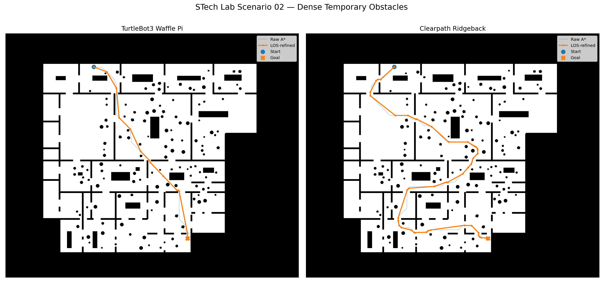
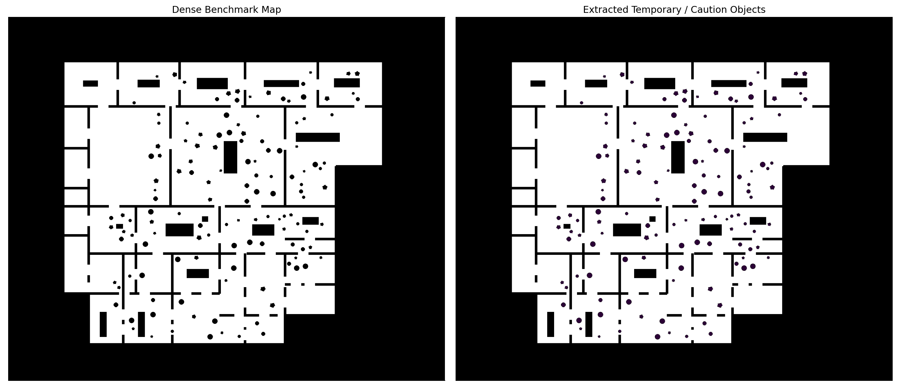
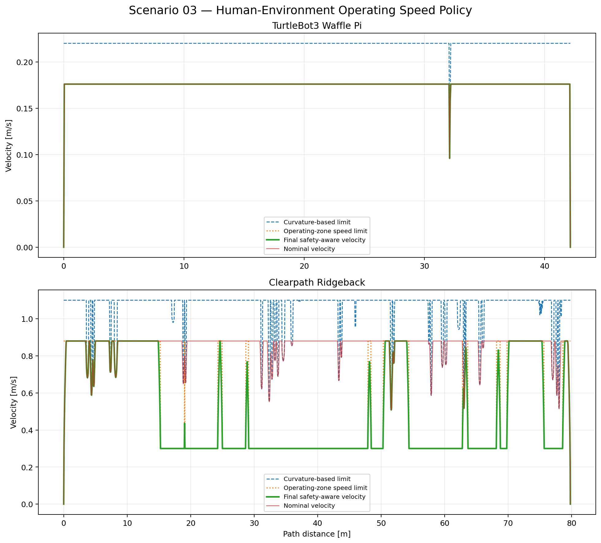
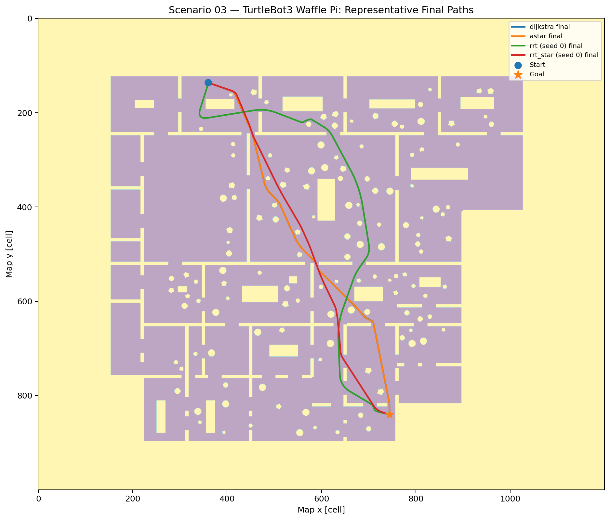
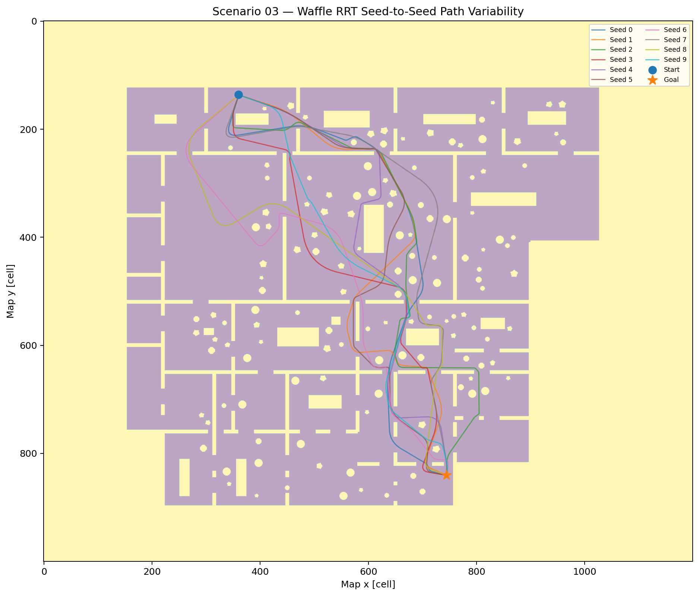
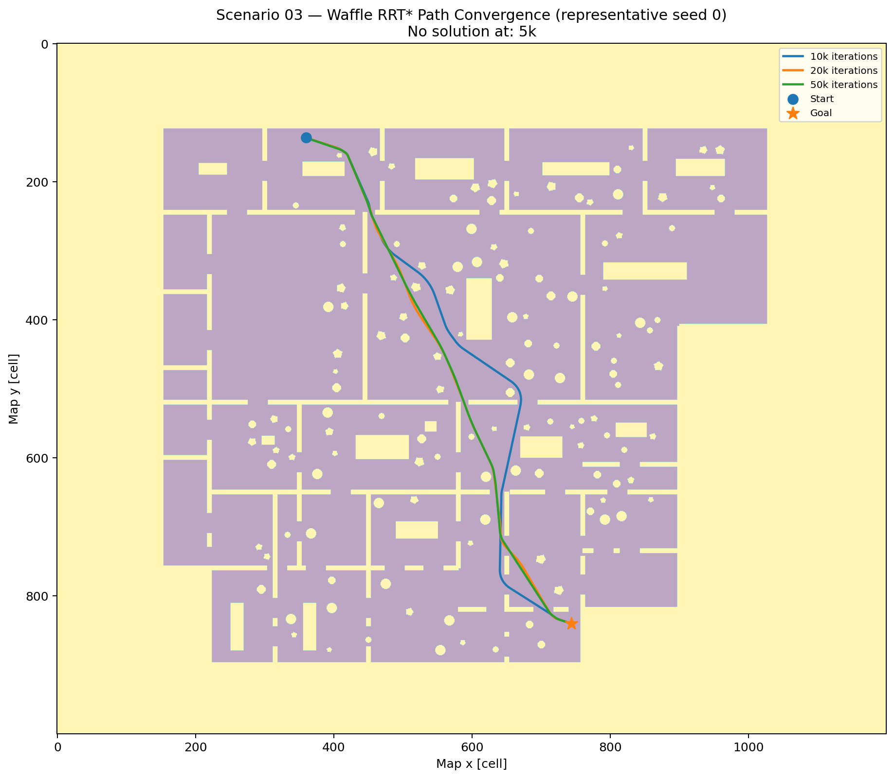
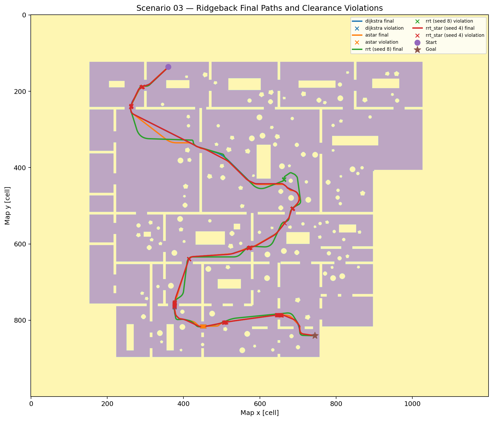

# Robot-Aware Path Planning Benchmark

**From algorithm validation to robot-specific navigation feasibility and mission-level planner evaluation**

This project evaluates whether paths generated by established planning algorithms remain **physically feasible and operationally useful** when actual robot geometry, indoor clutter, safety clearance, path refinement, motion limits, and safety-aware operating policies are applied.

The objective is **not to propose a new planning algorithm**. Dijkstra, A*, RRT, and RRT* are used as controlled planner inputs inside one robot-aware evaluation pipeline.

**Robots:** TurtleBot3 Waffle Pi · Clearpath Ridgeback  
**Planners:** Dijkstra · A* · RRT · RRT*  
**Environment:** Synthetic metric office / laboratory / warehouse-like indoor benchmark  
**Map resolution:** 0.05 m/cell

[Portfolio](https://sooyongtech.dev) · [Scenario 01 Video](https://youtu.be/_JqzPtMJXDU) · [Scenario 02 Video](https://youtu.be/mfaHRvUFsS4) · [Technical Report](./docs/Robot_Aware_Path_Planning_Benchmark.pdf)

---

## Project Objective

Classical path-planning benchmarks often evaluate a point robot in a binary occupancy map and compare planners primarily through path length or planning time. That is useful for algorithm validation, but it does not fully answer the engineering question faced by a physical mobile robot:

> **Can the actual robot execute the resulting path safely and efficiently under the tested environmental and operational constraints?**

This benchmark progressively introduces the factors that separate an abstract shortest-path problem from a robot navigation problem:

- physical robot footprint and robot-specific configuration spaces,
- narrow passages and bottlenecks,
- temporary / caution-required occupancy,
- a common resolution-consistent safety allowance,
- line-of-sight simplification and smoothing,
- continuous clearance validation,
- robot-specific motion limits,
- acceleration and deceleration limits,
- safety-aware operating-speed policy,
- stochastic planner variability,
- planning computation versus mission-level benefit.

The benchmark deliberately **does not tune safety margins, obstacle placement, or planner-specific cost functions after observing results simply to make every planner pass**. Failures and clearance violations are retained and quantified.

---

## Benchmark Pipeline

```text
Metric environment
  → Temporary / caution occupancy
  → Robot footprint
  → Robot-specific configuration space
  → Common safety allowance
  → Planner
  → Raw path
  → LOS simplification + smoothing
  → Continuous clearance validation
  → Robot-specific motion constraints
  → Caution-zone operating-speed policy
  → Mission time
```

The benchmark separates outcomes that are often incorrectly collapsed into one planner success/failure label:

```text
Mission infeasible
≠ Planner search failure
≠ Raw continuous-clearance failure
≠ Post-processing clearance failure
≠ Geometrically feasible but operationally inefficient
```

---

## Scenario Overview

| Scenario | Primary variable | Engineering question |
|---|---|---|
| **01 — Footprint-Driven Route Divergence** | Robot footprint | Can both robots physically use the same route? |
| **02 — Dense Temporary Clutter** | Temporary occupancy | How does clutter amplify robot-dependent route cost? |
| **03 — Safety-Aware Multi-Planner Evaluation** | Planner + execution policy | Does planner output remain feasible and useful through the complete execution pipeline? |

---

## Scenario 01 — Footprint-Driven Route Divergence

Scenario 01 isolates the effect of **robot geometry**. The physical environment, mission start, and mission goal are held fixed. Only the robot-specific configuration space changes.



| Robot | Final path length | Mission time |
|---|---:|---:|
| TurtleBot3 Waffle Pi | **42.29 m** | **192.86 s** |
| Clearpath Ridgeback | **48.57 m** | **48.97 s** |

The larger Ridgeback is forced onto a longer route, while its much higher available translational speed still produces a shorter mission time.

> **Shortest geometric path is not necessarily the shortest mission time.**

▶ [Watch Scenario 01 on YouTube](https://youtu.be/_JqzPtMJXDU)

---

## Scenario 02 — Dense Temporary Clutter

Scenario 02 introduces **132 temporary obstacles**—72 circular and 60 polygonal objects—to represent temporary or movable occupancy that may appear during normal indoor operation: people, carts, staged materials, equipment, or other local clutter.

These are not predicted dynamic trajectories. They form a controlled abstraction for studying route availability and clearance under denser occupancy.



| Robot | Final path length | Mission time |
|---|---:|---:|
| TurtleBot3 Waffle Pi | **42.34 m** | **193.09 s** |
| Clearpath Ridgeback | **79.47 m** | **79.03 s** |

The Waffle Pi retains a relatively direct route, while the larger Ridgeback experiences substantial configuration-space erosion and is forced onto a much longer alternative route.

> **Local clutter can amplify the navigation consequences of robot footprint.**

▶ [Watch Scenario 02 on YouTube](https://youtu.be/mfaHRvUFsS4)

---

## Scenario 03 — Safety-Aware Multi-Planner Evaluation

Scenario 03 fixes the robot and environment assumptions and compares Dijkstra, A*, RRT, and RRT* under the same downstream evaluation pipeline.

### Temporary / caution layer

The Scenario 02 clutter is retained as a separate temporary / caution-object layer for Scenario 03.



### Common safety allowance

An additional **0.025 m** is applied beyond the physical robot footprint. This is not presented as a universal industrial safety standard. It corresponds to half of the 0.05 m map resolution per side and provides a small, explicit, resolution-consistent allowance.

### Human-environment operating-speed policy

```text
Open-space cruise:
v_open = 0.8 × platform maximum speed

Caution-zone cap:
v_caution = min(v_open, 0.30 m/s)
```

Therefore:

- TurtleBot3 Waffle Pi: **0.176 m/s** open cruise; no additional reduction near caution objects.
- Clearpath Ridgeback: **0.880 m/s** open cruise; reduced to **0.300 m/s** near caution objects.



### Continuous feasibility

A planner reporting success does not automatically imply that the returned path remains feasible under the stricter continuous-clearance evaluation.

The benchmark records:

- raw-path feasibility,
- final-trajectory feasibility,
- minimum clearance,
- maximum clearance violation,
- violating sample count,
- violation-affected path length.

This distinguishes a small local safety-margin shortfall from a fundamentally invalid global route.

---

## Final Planner Benchmark

### Experimental conditions

- RRT seeds: **0–9**
- RRT* seeds: **0–9**
- Maximum stochastic iterations: **50,000**
- RRT* convergence checkpoints: **5k / 10k / 20k / 50k**

### TurtleBot3 Waffle Pi



| Planner | Planner success | Planning time | Final path | Safety-aware mission | Final feasibility |
|---|---:|---:|---:|---:|---:|
| Dijkstra | Yes | **7.55 s** | **42.13 m** | **240.08 s** | Yes |
| A* | Yes | **1.10 s** | **42.14 m** | **240.16 s** | Yes |
| RRT | 10/10 | ~**1.0 s median** | ~**53.10 m median** | ~**302.15 s median** | **7/10** |
| RRT* | 10/10 | ~**402 s median** | ~**41.66 m median** | ~**237.16 s median** | **9/10** |

RRT* eventually produces a slightly shorter path than A*, but the mission benefit is small relative to its additional planning computation:

```text
A*    : ~1.1 s planning  → 240.16 s mission
RRT*  : ~402 s planning  → 237.16 s mission
```

### RRT seed variability



The Waffle Pi reaches planner-level success for all ten RRT seeds, but final route geometry and mission time vary substantially.

### RRT* convergence



Representative Waffle RRT* seed:

| Iteration budget | Result |
|---:|---|
| 5,000 | No solution |
| 10,000 | 45.03 m / 256.27 s |
| 20,000 | 41.75 m / 237.77 s |
| 50,000 | 41.67 m / 237.17 s |

The improvement from 20k to 50k is small compared with the additional computation. The benchmark deliberately measures that inefficient region instead of assuming a lower iteration budget in advance.

---

### Clearpath Ridgeback

| Planner | Planner success | Planning time | Final path | Safety-aware mission | Final feasibility |
|---|---:|---:|---:|---:|---:|
| Dijkstra | Yes | **3.63 s** | **79.41 m** | **203.59 s** | No |
| A* | Yes | **2.98 s** | **79.81 m** | **205.33 s** | No |
| RRT | **7/10** | variable | ~**86.64 m median** | ~**222.10 s median** | **0/7 successful trials** |
| RRT* | **7/10** | ~**170 s median** | ~**79.37 m median** | ~**203.55 s median** | **0/7 successful trials** |

For deterministic planners, Ridgeback raw paths satisfy the continuous clearance requirement, but the common geometric refinement produces small local margin violations:

```text
Dijkstra final maximum violation : 14.2 mm
A* final maximum violation       :  8.2 mm
```



The larger configuration-space footprint also changes stochastic search difficulty: RRT and RRT* each succeed in only **7 of 10** Ridgeback trials within 50,000 iterations, compared with **10 of 10** for Waffle.

> **Robot footprint changes not only route availability, but planner reliability and convergence behavior.**

---

## Engineering Findings

1. **Robot geometry changes feasibility before planning.**  
   The same physical map becomes a different planning problem when robot footprint is applied.

2. **Clutter changes how much nominal platform performance can actually be used.**  
   Larger robots are more strongly affected by passage width and temporary occupancy.

3. **Planner success is not equivalent to execution feasibility.**  
   A planner-successful route may fail continuous validation, and common refinement may introduce a local clearance violation.

4. **Better geometric path cost does not guarantee better engineering value.**  
   RRT* can produce a shorter path while requiring dramatically more planning computation for very small mission-level gain.

5. **Robot footprint changes planner search difficulty.**  
   Waffle achieves 10/10 stochastic success; Ridgeback achieves 7/10 under the final budget.

---

## Planner Trade Study

### Dijkstra
- reliable deterministic baseline,
- optimal under the common discrete grid model,
- substantially more unnecessary search than A*.

### A*
- deterministic and computationally efficient,
- practical path quality almost identical to Dijkstra,
- strongest overall balance of reliability, computation, path quality, and mission performance **within this benchmark**.

### RRT
- rapid first-feasible behavior,
- substantial seed variability,
- weaker path quality,
- weaker continuous-clearance robustness.

### RRT*
- strong path-length convergence with sufficient computation,
- near-best Waffle trajectory length,
- very high computational cost,
- limited mission-level gain relative to A*,
- path-length optimization does not inherently optimize clearance.

> **Planning quality is not path length alone.**

```text
Engineering planning quality
= f(reliability, feasibility, computation, execution cost)
```

---

## Repository Structure

```text
04_robot_aware_path_planning/
├── README.md
├── benchmark/
├── planners/
├── robots/
├── metrics/
├── visualization/
├── config/
├── data/
├── results/
├── docs/
│   ├── Robot_Aware_Path_Planning_Benchmark.pdf
│   └── figures/
└── videos/
    └── README.md
```

The source repository retains the algorithm-validation work, Scenario 01/02 development results, Scenario 03 pilot data, final benchmark CSVs, visualizations, and reproducibility logs rather than presenting only the final screenshots.

---

## Technical Report

The full engineering report documents:

- independent planner implementation validation,
- metric environment design,
- robot-specific configuration spaces,
- Scenario 01–03 methodology,
- path refinement,
- continuous clearance validation,
- operating-speed policy,
- stochastic benchmarking,
- RRT* convergence,
- engineering trade analysis,
- limitations,
- development diagnostics and reproducibility details.

**[Open the full technical report](./docs/Robot_Aware_Path_Planning_Benchmark.pdf)**

---

## Videos

### Scenario 01 — Robot-Aware Path Planning
Footprint-driven route divergence between TurtleBot3 Waffle Pi and Clearpath Ridgeback.  
▶ https://youtu.be/_JqzPtMJXDU

### Scenario 02 — Path Planning in Dense Temporary Clutter
Robot-dependent route planning and mission performance under dense temporary occupancy.  
▶ https://youtu.be/mfaHRvUFsS4

### Scenario 03 — Safety-Aware Multi-Planner Evaluation
Video to be added.

---

## Reproducibility

Final Scenario 03 data products include:

```text
results/stech_lab/scenario03/final_benchmark/
├── scenario03_planner_trials.csv
├── scenario03_planner_summary.csv
├── scenario03_rrt_star_convergence.csv
├── scenario03_final_benchmark.log
└── visualization/
```

Sampling-based experiments use explicitly controlled random seeds.

Representative stochastic paths used for visualization are selected as the successful trial with mission time nearest the successful-trial median, rather than manually choosing visually favorable paths.

---

## Limitations

The benchmark intentionally stops short of claiming full real-world navigation validation.

Current limitations include:

- orientation-independent circumscribed-circle footprint approximation,
- no explicit SE(2) planning state,
- temporary objects treated as static snapshots rather than predicted moving agents,
- no local-planner or online-replanning benchmark,
- simplified Ridgeback translational dynamics,
- no wheel-level mecanum dynamics,
- no localization-uncertainty model,
- no closed-loop tracking-error experiment,
- no real sensor-delay or actuator model,
- Scenario 03 operating-speed policy is a benchmark policy rather than a universal safety standard,
- the 0.025 m allowance is resolution-consistent rather than a certified physical safety margin,
- RRT/RRT* nearest-neighbor search uses a simple linear scan,
- stochastic statistics use ten seeds and are intended as an engineering benchmark rather than a large-sample statistical study.

---

## Portfolio

https://sooyongtech.dev
